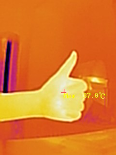

# thermal-camera

海康 TB-4117-3/S 热成像模组（USB VID:PID `2bdf:0101`）的 Rust 采集工具：
抓 240×320 MJPEG 视频帧、读取 120×160 全帧温度矩阵（f32 °C，与设备 OSD
数值一致）、单像素/区域测温。



协议逆向文档见 `docs/hcusb-uvc-protocol.md`。

## 设备接入（WSL2）

Windows 侧用 usbipd-win 转发（管理员 PowerShell，bind 只需一次）：

```powershell
usbipd bind --busid <BUSID> --force   # 一次性，持久化（绑定的是设备本身）
```

每次重插/重启后要重新 attach（免管理员）。**换 USB 口后 busid 会变**——
可以不离开 WSL 直接操作：

```bash
USBIPD="/mnt/c/Program Files/usbipd-win/usbipd.exe"
"$USBIPD" list | grep 2bdf            # 查出当前 busid（注意相机换口会变）
"$USBIPD" attach --wsl --busid 19-1
```

WSL 侧已配好 udev 规则（`/etc/udev/rules.d/99-hikcamera.rules`，
`SUBSYSTEM=="usb", ATTR{idVendor}=="2bdf", MODE="0666"`）。

注意：内核 uvcvideo 驱动对本设备不可用（虚标 YUY2，实际只发 MJPEG，帧帧
报错）；本项目走 libusb 直读，不依赖 /dev/video*。

## 构建与运行

```bash
cargo build
# 访问 USB 需要 video 组权限（或 root）
sg video -c './target/debug/thermal-camera frames=1 out=/tmp/tc'
```

## 用法

```
thermal-camera [frames=N] [out=DIR] [point=X,Y]... [roi=X,Y,W,H]... [temps=FILE] [comp=on]
```

- `frames`/`out`：从视频流抓 N 张 240×320 JPEG（带 OSD）到 DIR
  （默认 3 张到 ./captures；`frames=0` 跳过）
- `point=X,Y`：查单个像素的温度，坐标为 240×320 显示坐标（可多个）
- `roi=X,Y,W,H`：查矩形区域最高温，同上坐标系（可多个）
- `temps=FILE`：把 120×160 温度矩阵导出为 CSV
- `comp=on`：保留设备的体温补偿（默认**关闭**：读数为真实表面温度，
  退出时自动恢复设备原配置）

测温类参数会触发一次 2046 辐射测量抓拍（约 1–2 秒）；温度矩阵坐标 ×2
即显示坐标。

示例：

```bash
sg video -c './target/debug/thermal-camera frames=1 out=/tmp point=120,160 roi=0,0,240,320 temps=/tmp/temps.csv'
```

输出：

```
/tmp/tc/frame_000.jpg: 9719 bytes, 117.5 fps avg
radiometric capture: 120x160 matrix
frame max: 40.4 C at display (192, 10)
point (192, 10): 40.4 C
point (120, 160): 29.5 C
roi (0, 0, 240x320): max 40.4 C at display (192, 10)
```

## 库 API（`src/lib.rs`）

- `Device::open()` / `start_stream()` / `frames()`：视频流
  （`start_stream` 内含版本探测，重插后必须执行才能解锁 XU 命令通道）
- `capture_radiometric()`：2046 命令，JPEG + 120×160 f32 温度矩阵
- `roi_max_temperatures()` / `pixel_temperature()`：2047 ROI 测温
  （注意：对小热点有稀释，精确逐像素请用 2046）
- `body_temp_compensation()` / `set_body_temp_compensation()`：2044/2045
  体温补偿开关（CLI 默认运行时关闭、退出恢复）
- `simple_get()` / `double_get()`：通用 XU 命令事务

`src/bin/` 下的其余 binary 是协议探索期的诊断工具（XU 扫描、规则导出等），
另有一个实用的 `record`：每分钟记录一组 OSD 帧 + 辐射原图 + 温度矩阵 CSV
到 `captures/record/`（Ctrl+C 停止，退出时恢复设备补偿配置）。

## Credit

HCUSB UVC 协议逆向与主要实现由 [Kimi](https://www.kimi.com)（Moonshot AI
编程助手）完成；vilicvane 提供硬件、协助真机验证并发布本仓库。

The HCUSB UVC protocol was reverse-engineered, and most of this codebase
written, by Kimi (Moonshot AI's coding assistant); vilicvane provided the
hardware, assisted with on-device verification, and published this repo.
